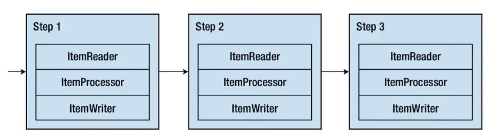

# Curso para desenvolvimento de jobs com Spring Batch

## Introdução

### Instalação

#### Linux
> Instalando Java
- sudo apt install openjdk-8-jdk
- java -version
> Instalando Mysql
- sudo apt install mysql-server
- Colocar senha
    - sudo mysql
    - uninstall plugin validate_password
    - CREATE USER 'nome_user'@'localhost' IDENTIFIED BY '123456';
    - GRANT ALL PRIVILEGES ON *.* TO 'nome_user'@'localhost';
    - exit
    - mysql -u nome_user -p
    - create database spring_batch;
> Instalando STS
- [STS](https://spring.io/tools)
- mkdir Tools
- cd Tools
- curl https://download.springsource.com/release/STS4/4.17.0.RELEASE/dist/e4.26/spring-tool-suite-4-4.17.0.RELEASE-e4.26.0-linux.gtk.x86_64.tar.gz --output sts4.17.0.tar.gz
- tar -xf sts4.17.0.tar.gz
> Cria um lançador para o arquivo
- vim ~/.local/share/applications/sts.desktop
```
[Desktop Entry]
Type=Application
Version=4.17.0
Name=STS
Comment=Spring Tool Suite 4
Icon=/home/usuario/Tools/sts-4.17.0.RELEASE/icon.xpm
Exec=/home/usuario/Tools/sts-4.17.0.RELEASE/SpringToolSuite4
Terminal=false
StartupNotify=false
Categories=Development
```
#### Windows
- [Java](https://www.oracle.com/br/java/technologies/javase/javase8u211-later-archive-downloads.html)
- java -version
- [MySql](https://dev.mysql.com/downloads/mysql/5.7.html)
- Deve colocar o caminho do Mysql até o bin no PATH das variáveis de ambiente

## Visão geral do Spring Batch

- Palavras chaves
    - Rotinas automáticas
        - enviar e-mail, notificações, folha de pagamento, etc...
    - Grande volume de dados
- Definição
> "Um sistame que realiza um processamento de uma quantidade finita de dados sem interação ou interrupção."
- **Ao criar um aplicação e adicionar a depeência do Batch também é necessário colocar um banco, caso contrário a aplicação não funciona, necessário um banco porque ele salva metadados.**

## Trabalhando com Jobs e Steps
- **JOB**
> "Coleção de estados e transições de um para o outro definidas por steps" = Máquina de estados

#### Steps


- **JobLaucher**
    - Execução do Job
- **Job Repository**
    - Estado do Job e seus steps = Metadados do Spring Batch

#### job repository


#### Persistência de metadados no banco de dados
- Quantas execuções lógicas foram executadas
```SELECT * FROM BATCH_JOB_INSTANCE;```
- Quantas vezes o batch executou no total, mesmo com erros
```SELECT * FROM BATCH_STEP_EXECUTION;```
- Quais dados foram salvos
```SELECT * FROM BATCH_JOB_EXECUTION_CONTEXT;```
- Quais steps executaram
```SELECT * FROM BATCH_STEP_EXECUTION;```
- Informações dos Steps
```SELECT * FROM BATCH_STEP_EXECUTION_CONTEXT;```

#### Múltiplas execuções e escopo
- limpar tabelas 
```
delete from BATCH_JOB_EXECUTION_CONTEXT;
delete from BATCH_JOB_EXECUTION_PARAMS;
delete from BATCH_JOB_EXECUTION_SEQ;

delete from BATCH_STEP_EXECUTION_CONTEXT;
delete from BATCH_STEP_EXECUTION_SEQ;
delete from BATCH_STEP_EXECUTION;

delete from BATCH_JOB_EXECUTION;
delete from BATCH_JOB_INSTANCE;
delete from BATCH_JOB_SEQ;
```
> Adicionando parâmetros para o projeto
- Botão direito no projeto
- run as
- run configurations
-  na janela que abre procure arguments e ensira o nome e valor
    - nome=teste

- A forma no qual o step define sua lógica o define como:
    - *TASKLET*
        - pequenas tarefas
        - pré processamento
        - limpeza de aquivos, criar diretórios, etc...
    - *CHUNK*
        - Tarefas complexas
        - processamento em pedaços
        - divididos em 
            - Leitura
            - Processamento
            - Escrita
### Complementares
- [Desenvolvimento com Spring Batch — Overview](https://giuliana-bezerra.medium.com/spring-batch-para-desenvolvimento-de-jobs-1674ec5b9a20)
- [Why you should be using Spring Batch for batch processing](https://giuliana-bezerra.medium.com/why-you-should-be-using-spring-batch-for-batch-processing-83f5aafb965f)

### Detalhes Docker applicação 2

docker container run -e MYSQL_PASSWORD=123456 -e MYSQL_DATABASE=spring_batch  --name spring_batch -p 3306:3306 mysql --character-set-server=utf8mb4 --collation-server=utf8mb4_unicode_ci
